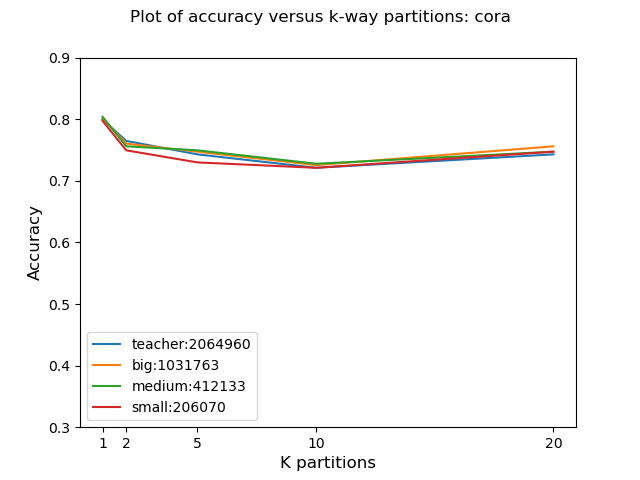
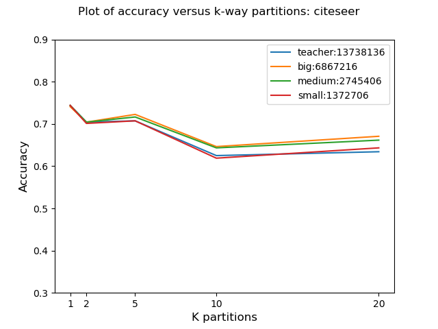
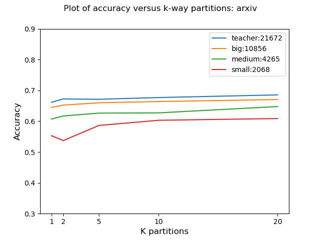
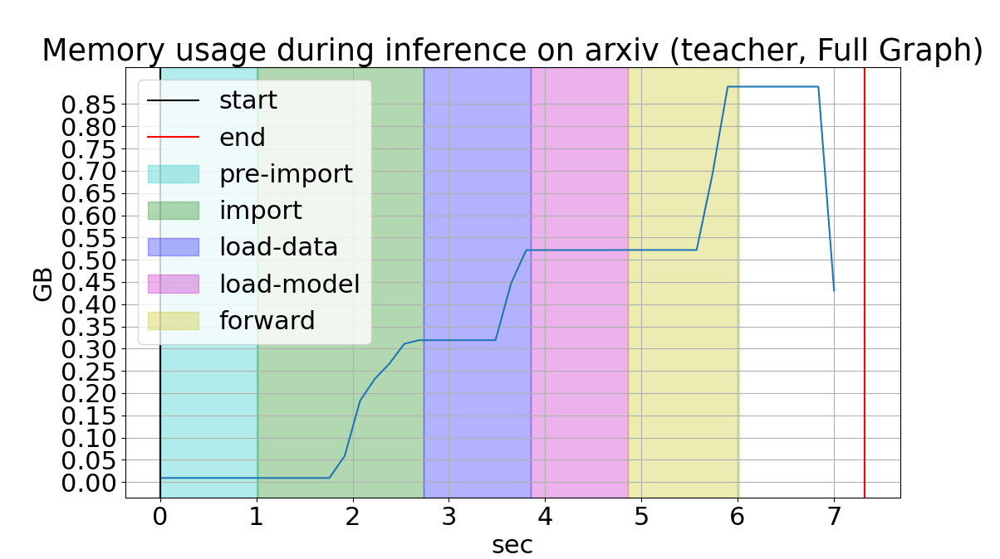
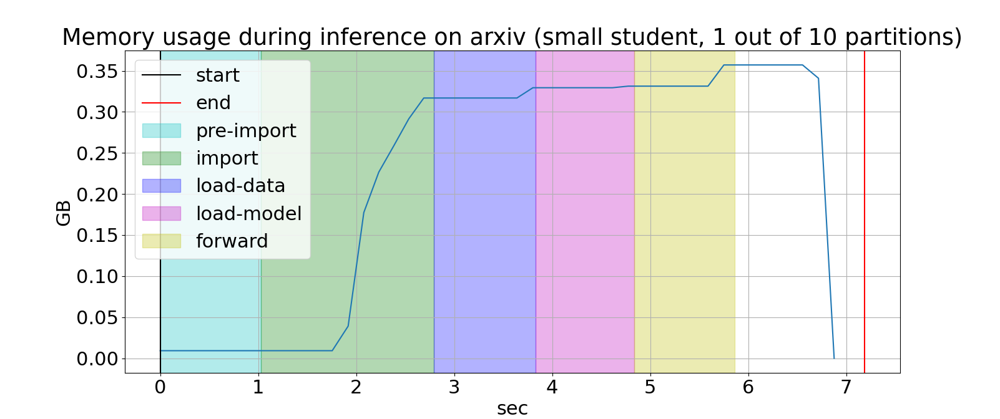
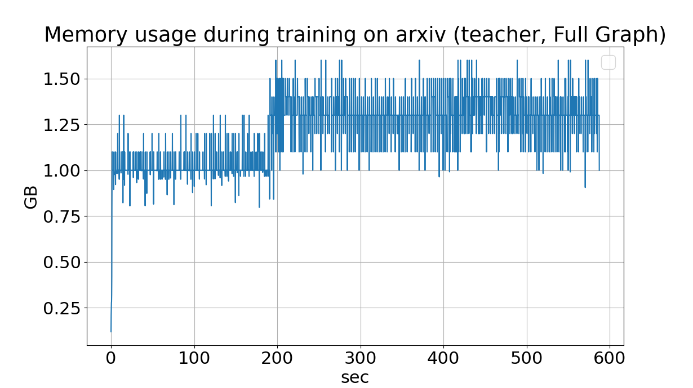
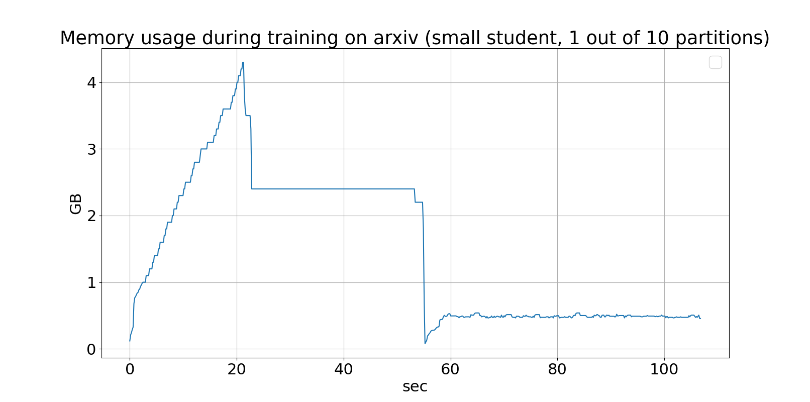

# ECE381K RWN Project
# Graph Neural Network Compression for Edge Devices
# Mustafa Munir and Geffen Cooper

# Overview
This repository contains the source code for our ECE381K project: *Graph Neural Network Compression for Edge Devices*. The directory structure is as follows

### data
Contains the data for arxiv, citeseer, and cora datasets. Contains .gexf and .gephi files for visualizations of data as well in gephi.
* arxiv = contains arxiv data.
* citeseer = contains citeseer data.
* cora = contains cora data. 

### notebooks
Contains iPython notebooks and generated .gexf files. These are mainly used for scratch work but also show how to load datasets with dgl and networkx and use METIS.

### scripts
Contains some miscellaneous scripts used throughout the project as well as reference scripts.

### src
Contains the primary code for the project actually implementing the partitioning, knowledge distillation, parallelization, and subgraph training.
* archive = contains some archived results/code.
* gml = contains gml files of some datasets partitions.
* logs = contains some log files generated for debugging and memory profiling
* parallelization_playground = contains some practice parallelization files for debugging parallelization.
* Files
	- **convert.ipynb** = creates .gml files to visualize subgraphs in gephi with labels, predictions etc.
	- **datasets.py** = just loading datasets.
	- **evaluate_all.py** = used to evaluate the accuracy of all teacher and student models after training
	- **evaluate_teacher.py** = only shows the accuracy of the teacher model
	- **generate_partitions.py** = called before train_parallel.py to save partitions to files for each process to access.
	- **models.py** = load all models.
    - **new_train_parallel.py** = complete parallel training script using multiprocessing.
	- **partition_graph.py** = partitions graph using METIS python API
	- **prof_mem_inference.sh** = bash script for profiling memory during inference.
    -  **prof_mem_training.sh** = bash script for profiling memory during training.
	- **train.py** = non-parallel complete training script.
	- **train_all.sh** = train models bash script.
	- **train_all_p.sh** = train all models in parallel bash script.
	- **train_arxiv.sh** = train arxiv bash script.
	- **train_citeseer.sh** = train citeseer bash script.
	- **train_cora.sh** = train cora bash script.
	- **train_no_student.py** = train script with no knowledge distillation/student.
	- **train_parallel.py** = parallel training not using multiprocessing, instead relying on bash to call python multiple times.
	- **train_products.sh** = train ogbn products bash script.
	- **viz_mem_inference.py** = generating plots for visualization of inference time memory usage.
    - **viz_mem_train.py** = generating plots for visualization of training time memory usage.
	- **viz_subgraphs.py** = obsolete code for seeing accuracy of subgraphs.

# Usage

## Installation
We use several packages in this repo. You can replicate the conda environment by using


```
conda env create -f environment.yml
```

METIS must also be downloaded and installed.The instructions are at this link: http://glaros.dtc.umn.edu/gkhome/metis/metis/download

## Training
Once the environment is set up, you can start training using the following scripts:

* **train_all.sh**: this script has no arguments but rather is used to train all the GNNs on all the datasets (including knowledge distillation).
    - this script relies on **train.py** which is the main python script used for training. The arguments to this script are:
```=================
usage: train.py [-h] [--gnn GNN] [--k K] [--dataset DATASET] [--heads HEADS] [--dropout DROPOUT]
                [--no_cuda NO_CUDA] [--student_only STUDENT_ONLY] [--compression_rate COMPRESSION_RATE]

Training and Evaluation

optional arguments:
  -h, --help            show this help message and exit
  --gnn GNN             GNN architecture (GCN, GAT, GSAGE)
  --k K                 how many partitions to split the input graph into
  --dataset DATASET     name of the dataset (cora, citeseeor, arxiv, ogbn_products)
  --heads HEADS         If using GAT provide num_heads, otherwise enter 0
  --dropout DROPOUT     Dropout rate. 1 - keep_probability = dropout rate
  --no_cuda NO_CUDA     If True then will disable CUDA training
  --student_only STUDENT_ONLY
                        If True then will train student model only
  --compression_rate COMPRESSION_RATE
                        compression rate for KD (big, medium, small)
```
As an example, the first line in **train_all.sh** is 
```
python train.py --gnn=GCN --k=1 --dataset=cora --compression_rate=big
```

which trains a GCN using 1 partition (full graph) on the cora dataset with a big compression rate for the student model. 

**Trained models get saved to src/saved_models/[file_name.pth]** where the filename will be determined by the command line arguments.

* **train_all_p.sh**: this script has no arguments but rather is used to train all the GNNs **in parallel** on all the datasets (including knowledge distillation).
    - this script relies on **train_parallel.py** which is the main python script used for training a single partition. This script is nearly identical in functionality to **train.py** except that it gets called multiple times to train partitions on multiple cores. See **train_all_p.sh** for details.
    - note that **generate_partitions.py** must be called first because each process will need access to its given partition. Again see **train_all_p.sh** for details.


## Evaluation
Once training is complete, evaluation on the validation set can be done. To do this simply run **evaluate_all.py**. Note that this will only work if all models are trained. If only a subset of the models are trained you can specify this at the top of the python script by commenting out the other options. This script should output the following three plots and print the validation accuracies of each individual subgraph.




## Memory Profiling
### Inference
To profile the GNNs during inference, we use the bash script **prof_mem_inference.sh** with the following arguments: 
```
./prof_mem_inference [gnn] [k] [dataset] [ts] [cr] [parallel]

gnn = GCN
k = the number of partitions (use in parallel mode)
dataset = (cora, citeseer, arxiv)
ts = (t,s) to specify if to do inference with teacher or student
cr = (big, medium, small) the compression rate
parallel = (y,n) specifies whether to profile one partition on a single core to see the cost when running in parallel. Specify the number of partitions using k
```

An example usage is
```
./prof_mem_inference.sh GCN 1 arxiv t big n
```
The script should output a figure like this


We can compare to the memory usage during inference over a single partition out of ten on a small student model.
```
./prof_mem_inference.sh GCN 10 arxiv s big y
```


### Training
We can also profile training using similar arguments except there is an additional argument *student only (y,n)* which can be used to train only the student assuming a pretrained teacher is available. We use similar arguments to the inference case

```
./prof_mem_training.sh GCN 1 arxiv t big n n
```


```
./prof_mem_training.sh GCN 10 arxiv s big y y
```


To replicate the figure from the poster which has multiple plots in one figure, see the commented out code in **viz_mem_train.py** as multiple log files must be parsed and multiple plots need to be overlayed on eachother. This can be done by hard coding the file names. The plot for training memory usage in the poster has one mistake. We forgot to include memory usage for partitioning when training in parallel and accidentally included memory usage for partitioning when training on the whole graph. In the new plots shown above we see that there is an initial large memory spike for partitioning because we copy the graph and METIS has high memory consumption but then each partition only uses about 0.5 GB for training. For full graph training the memory usage goes down to around 1 GB since this does not require partitioining.
